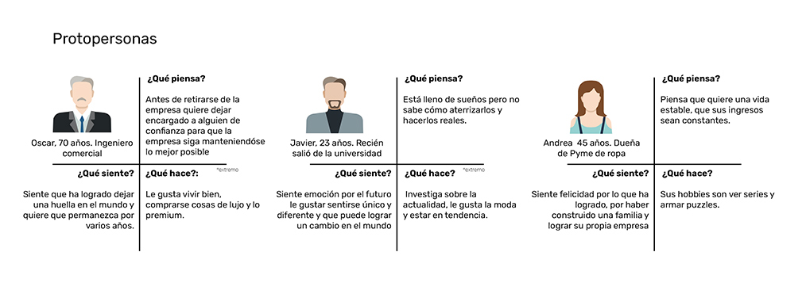
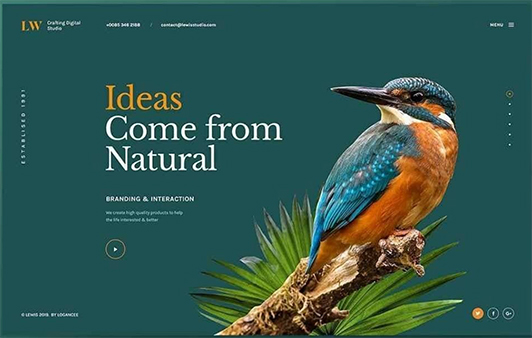
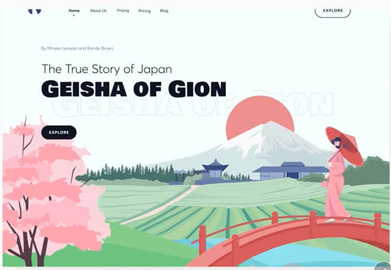
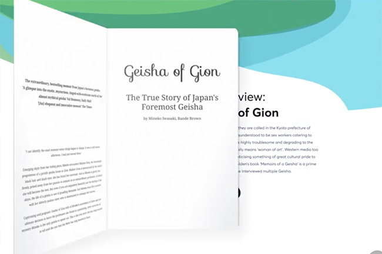
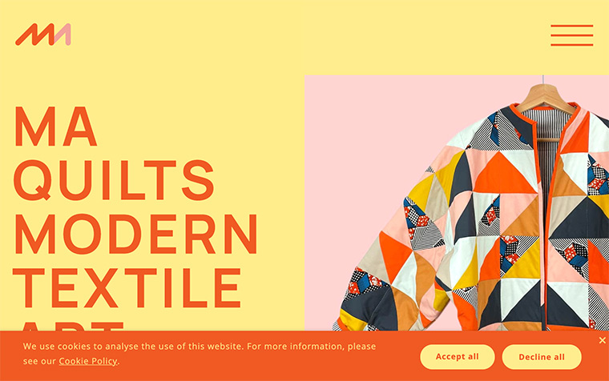
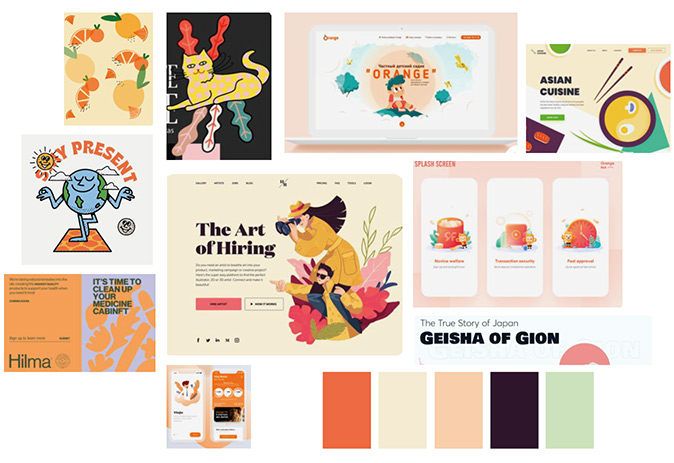

# Exámen dno037
**¿Para qué?**
Dar a conocer mis trabajos universitarios. Que mi dominio propio comunique mi esencia.

**¿Para quienes?**

**Antecedente ¿Qué existe que es similar a la propuesta?** 

Rescato: Fila de tres imagenes

Cambiaria: En vez de cambiar por pagina, deslizaria para mostrar mas trabajos.
Haría que las imagenes fueran de distinto tamaño. Cuando se vea en el celular solamente una imagen a la vez.

Rescato: Como usa el color para resaltar lo importante y los contrastes que se generan. La barra de menu al costado

Cambiaria: La tipografia sans-serif no me agrada, ni el color de fondo.

https://www.awwwards.com/sites/wildwood-bakery 

Rescato: Me gusta como se integra la ilustracion al sitio web, como se distorciona la palabra "wildwood". Acotarse a 3 colores encuentro que suma porque se le da más importancia a los trabajos expuestos. También como se fusionan la tipografía y las imagenes y se leen juntas, la diagramacion me gusta. 

Cambiaria: Los colores e ilutraciones.

https://www.sophiebritt.com/

Rescato: El display de la pagina es interesante, me gusta como muestra el proyecto y aparece el nombre y el año y luego añade un "ver más" para que podamos ver con detalle de que trata el proyecto. Tambien me gustan los gift que se muestran.

Cambiaria: haria que el botón nos dirigiera nuevamente a la pagina de inicio en vez de mostrarnos con detalle los siguientes proyectos.

https://www.awwwards.com/inspiration/ui-interactions-of-the-week-5

Rescato: El display de la pagina me encanta, como se abre el libro al y va mostrando ese proyecto, también como no se pierde la imagen de inicio. La ilustracion principal aporta mucho en comunicar la estetica y el tema. Es mi antecedente favorito, todo sigue una misma estetica.

https://www.maquilts.com/

Rescato: La combinación de colores, y el tamaño de la tipografía. Graficamente me gusta mucho, encuentro que para alguien con problemas a la vista es una propuesta muy acertada.

Cambiaria: Todo el contenido, imagenes.

**¿Qué existe que puede inspirar la propuesta?**

Este moodboard es para inspirarme en la grafica, colores, ilustraciones, tipografias, etc. Hay imagenes de los antecedentes y también hay nuevas
