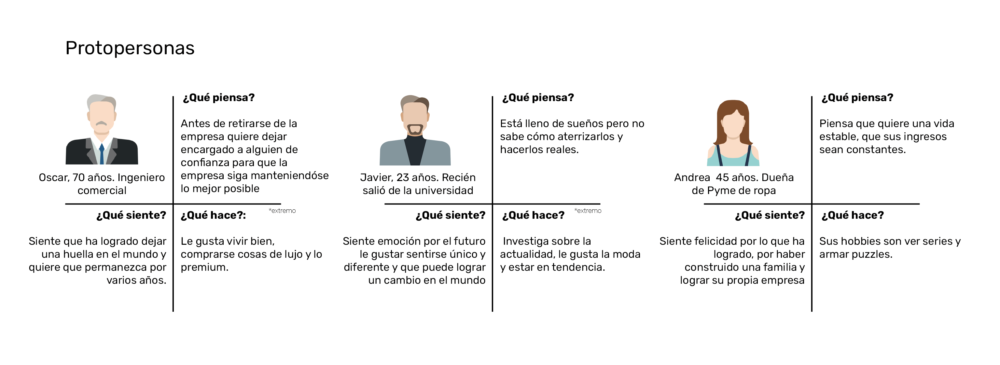

# Exámen dno037
**¿Para qué?**
Dar a conocer mis trabajos universitarios.

**¿Para quienes?**

**Antecedente ¿Qué existe que es similar a la propuesta?** 

Rescato: -Fila de tres imagenes
Cambiaria: -En vez de cambiar por pagina, deslizaria para mostrar mas trabajos.
-Haría que las imagenes fueran de distinto tamaño
-Cuando se vea en el celular solamente una imagen a la vez.

https://www.instagram.com/p/CPX4EeYjs6S/ Es interesante como se deja espacio al texto y no se fusiona con la imagen, llama más la atención. Me gusta que los iconos de contacto esten a la derecha arriba y que se mantenga para así sea más facil ubicarme.

https://www.awwwards.com/sites/wildwood-bakery me agradan las ilustraciones 2D al inicio.

https://www.instagram.com/p/CNQ6SklIe2s/ la mayoria de mis trabajos son anaranjados/verdes por lo que me gusta el color de fondo y la fusión de colores

https://www.garciajoshua.com/nonprofit Me gusta que haya una barra con distintas secciones ej: contacto, inicio, infografías, etc aunque prefiero a la derecha antes que la izquierda. 

https://www.maquilts.com/ Me gusta la tipografía y la combinación de colores.

**¿Qué existe que puede inspirar la propuesta?**

https://www.packagingoftheworld.com/, como de muestran los distintos proyectos

