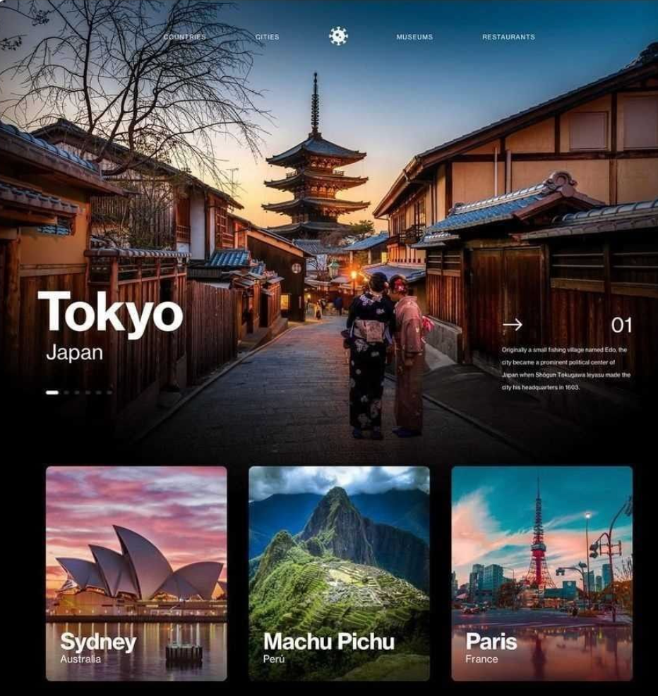
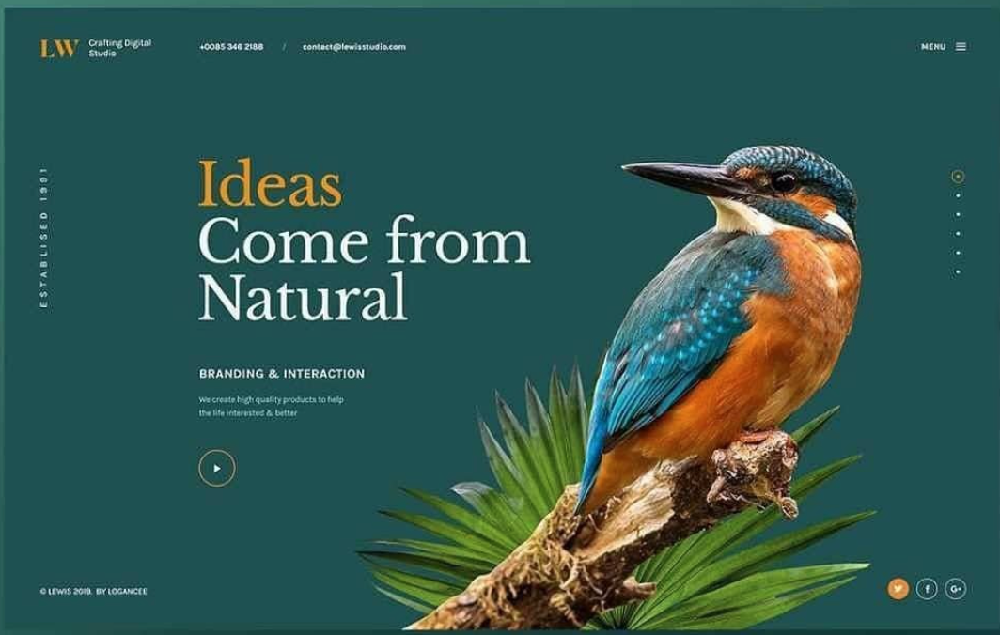
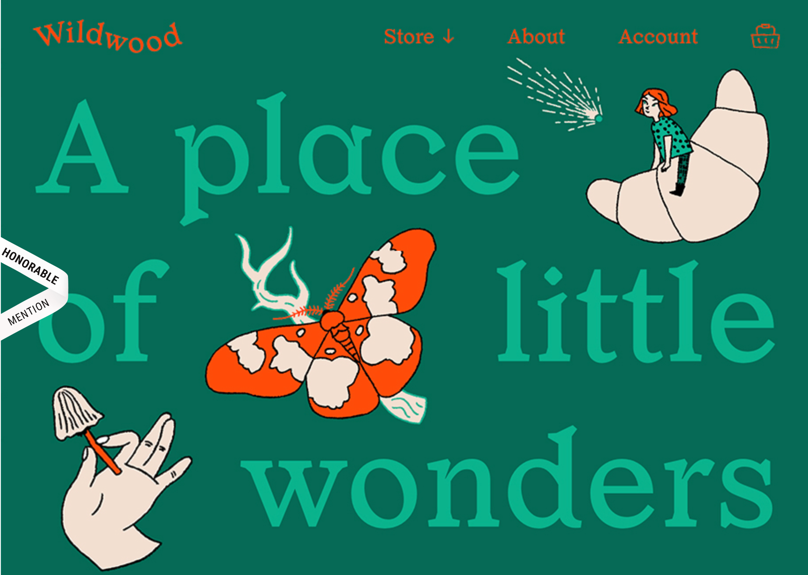
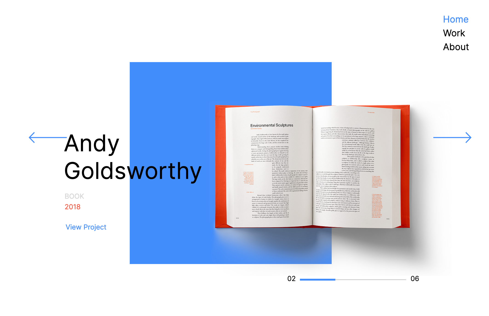

# Exámen dno037
**¿Para qué?**
Dar a conocer mis trabajos universitarios.

**¿Para quienes?**

**Antecedente ¿Qué existe que es similar a la propuesta?** 

Rescato: Fila de tres imagenes

Cambiaria: En vez de cambiar por pagina, deslizaria para mostrar mas trabajos.
Haría que las imagenes fueran de distinto tamaño. Cuando se vea en el celular solamente una imagen a la vez.

Rescato: Como usa el color para resaltar lo importante y los contrastes que se generan. La barra de menu al costado

Cambiaria: La tipografia sans-serif no me agrada, ni el color de fondo.

https://www.awwwards.com/sites/wildwood-bakery 

Rescato: Me gusta como se integra la ilustracion al sitio web, como se distorciona la palabra "wildwood". Acotarse a 3 colores encuentro que suma porque se le da más importancia a los trabajos expuestos. También como se fusionan la tipografía y las imagenes y se leen juntas, la diagramacion me gusta. 

Cambiaria: Los colores e ilutraciones.

https://www.sophiebritt.com/

Rescato: El display de la pagina es interesante, me gusta como muestra el proyecto y aparece el nombre y el año y luego añade un "ver más" para que podamos ver con detalle de que trata el proyecto.

Cambiaria: haria que el boton

https://www.garciajoshua.com/nonprofit Me gusta que haya una barra con distintas secciones ej: contacto, inicio, infografías, etc aunque prefiero a la derecha antes que la izquierda. 

https://www.maquilts.com/ Me gusta la tipografía y la combinación de colores.

**¿Qué existe que puede inspirar la propuesta?**

https://www.packagingoftheworld.com/, como de muestran los distintos proyectos

